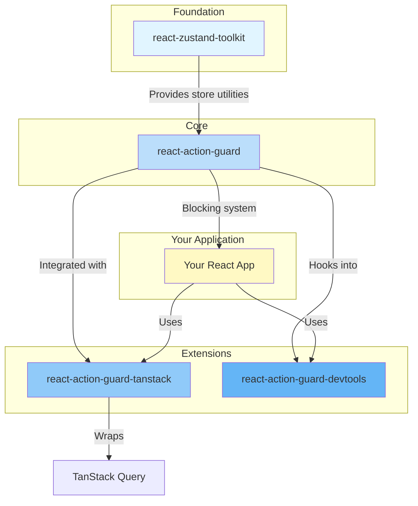
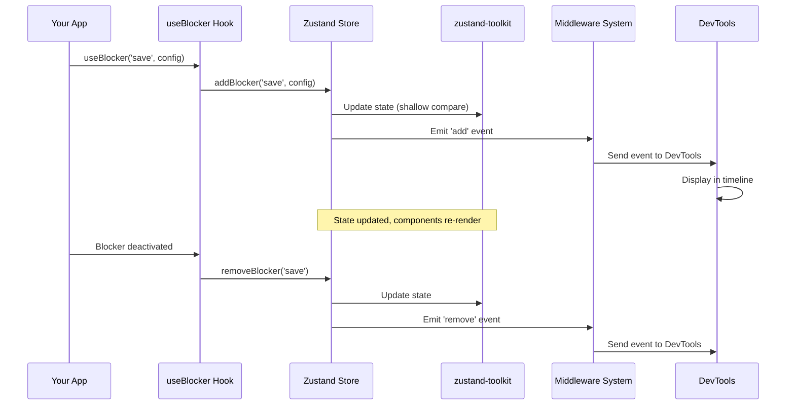
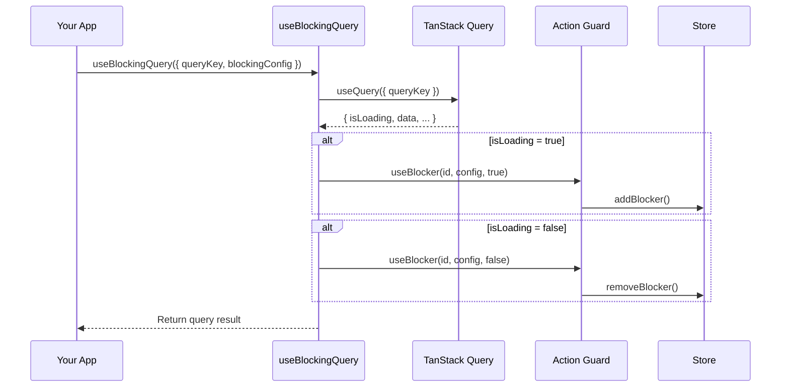

# Architecture Overview

Understanding how all four packages work together.

## Package Ecosystem

React Action Guard is a suite of  four interconnected packages, each serving a specific purpose:



## Package Responsibilities

### react-zustand-toolkit (Foundation)

**Purpose:** Provides enhanced Zustand store utilities

**Key Features:**
- Automatic shallow comparison
- Provider pattern for isolated instances
- Smart context resolution
- Type-safe store creation

**Used By:** `react-action-guard` internally

**Example:**
```typescript
import { createShallowStore } from '@okyrychenko-dev/react-zustand-toolkit';

const useStore = createShallowStore<State>((set) => ({
  // Automatic shallow comparison built-in
}));
```

**Learn More:** [react-zustand-toolkit docs](/packages/react-zustand-toolkit/)

---

### react-action-guard (Core)

**Purpose:** Core UI blocking management system

**Key Features:**
- Priority-based blocking
- Scoped blocking (global, specific areas)
- Timeout mechanism
- Middleware system
- Provider pattern (SSR, testing)

**Dependencies:** `react-zustand-toolkit`, `zustand`

**Example:**
```typescript
import { useBlocker, useIsBlocked } from '@okyrychenko-dev/react-action-guard';

// Block form while saving
useBlocker('save', { scope: 'form' }, isSaving);

// Check if blocked
const isBlocked = useIsBlocked('form');
```

**Learn More:** [react-action-guard docs](/packages/react-action-guard/)

---

### react-action-guard-devtools (Extension)

**Purpose:** Visual debugging for blocking events

**Key Features:**
- Real-time timeline
- Active blockers view
- Event filtering
- Performance monitoring

**Dependencies:** `react-action-guard`

**Example:**
```typescript
import { ActionGuardDevtools } from '@okyrychenko-dev/react-action-guard-devtools';

<ActionGuardDevtools /> // Add to your app
```

**Learn More:** [react-action-guard-devtools docs](/packages/react-action-guard-devtools/)

---

### react-action-guard-tanstack (Extension)

**Purpose:** TanStack Query integration

**Key Features:**
- Automatic blocking for queries/mutations
- Drop-in replacement for TanStack hooks
- Dynamic blocking reasons
- Configurable blocking conditions

**Dependencies:** `react-action-guard`, `@tanstack/react-query`

**Example:**
```typescript
import { useBlockingQuery } from '@okyrychenko-dev/react-action-guard-tanstack';

const query = useBlockingQuery({
  queryKey: ['users'],
  queryFn: fetchUsers,
  blockingConfig: {
    scope: 'users',
    reasonOnLoading: 'Loading users...',
  }
});
```

**Learn More:** [react-action-guard-tanstack docs](/packages/react-action-guard-tanstack/)

## Data Flow

### Blocker Lifecycle Across Packages



### TanStack Integration Flow



## Package Interconnections

### Layer 1: Foundation (zustand-toolkit)

Provides the base store utilities:
- `createShallowStore` - Used by action-guard for its store
- `createStoreProvider` - Powers UIBlockingProvider
- `createResolvedHooks` - Smart hook resolution

**Key Insight:** You can use zustand-toolkit independently for your own stores.

### Layer 2: Core (action-guard)

Built on top of zustand-toolkit:
- Uses `createShallowStore` for `uiBlockingStore`
- Uses `createStoreProvider` for `UIBlockingProvider`
- Exports hooks that work with both global and context stores

**Key Insight:** action-guard is a complete blocking system that doesn't require extensions.

### Layer 3: Extensions

Build on top of action-guard:

**DevTools:**
- Registers as middleware in action-guard
- Listens to blocker events
- Maintains separate timeline store

**TanStack:**
- Wraps TanStack Query hooks
- Calls action-guard hooks based on query state
- No direct dependency on zustand-toolkit

## Common Integration Patterns

### Pattern 1: Full Stack (All Packages)

```typescript
// Setup
import { UIBlockingProvider } from '@okyrychenko-dev/react-action-guard';
import { ActionGuardDevtools } from '@okyrychenko-dev/react-action-guard-devtools';
import { QueryClient, QueryClientProvider } from '@tanstack/react-query';

const queryClient = new QueryClient();

function App() {
  return (
    <QueryClientProvider client={queryClient}>
      <UIBlockingProvider>
        <YourApp />
        <ActionGuardDevtools />
      </UIBlockingProvider>
    </QueryClientProvider>
  );
}

// Usage
import { useBlockingQuery } from '@okyrychenko-dev/react-action-guard-tanstack';

function UserList() {
  const query = useBlockingQuery({
    queryKey: ['users'],
    queryFn: fetchUsers,
    blockingConfig: {
      scope: 'users',
      reasonOnLoading: 'Loading users...',
    }
  });
  
  return <div>{/* ... */}</div>;
}
```

### Pattern 2: Core + DevTools (No TanStack)

```typescript
import { useBlocker } from '@okyrychenko-dev/react-action-guard';
import { ActionGuardDevtools } from '@okyrychenko-dev/react-action-guard-devtools';

function App() {
  return (
    <>
      <YourApp />
      <ActionGuardDevtools />
    </>
  );
}

function MyComponent() {
  useBlocker('operation', { scope: 'form' }, isLoading);
}
```

### Pattern 3: Core Only (Minimal)

```typescript
import { useBlocker, useIsBlocked } from '@okyrychenko-dev/react-action-guard';

// No provider, no devtools, no tanstack
// Just blocking management

function MyComponent() {
  useBlocker('save', { scope: 'form' }, isSaving);
  const isBlocked = useIsBlocked('form');
}
```

### Pattern 4: Custom Stores with zustand-toolkit

```typescript
// Use zustand-toolkit for your own stores
import { createShallowStore } from '@okyrychenko-dev/react-zustand-toolkit';

const useMyStore = createShallowStore<MyState>((set) => ({
  // Your store logic
}));

// Still use action-guard for blocking
import { useBlocker } from '@okyrychenko-dev/react-action-guard';
```

## Design Principles

### 1. Separation of Concerns

Each package has a single, well-defined purpose:
- **zustand-toolkit**: Store utilities
- **action-guard**: Blocking logic
- **devtools**: Debugging
- **tanstack**: TanStack integration

### 2. Layered Architecture

Higher layers depend on lower layers, never the reverse:
```
Extensions (devtools, tanstack)
       ↓
Core (action-guard)
       ↓
Foundation (zustand-toolkit)
```

### 3. Optional Extensions

Core works independently. Extensions are truly optional:
- Use action-guard without devtools
- Use action-guard without tanstack
- Use zustand-toolkit without action-guard

### 4. Provider Pattern Throughout

All packages support providers for isolated state:
- **zustand-toolkit**: `createStoreProvider`
- **action-guard**: `UIBlockingProvider`
- **devtools**: Works with provider stores
- **tanstack**: Works within provider Scope

### 5. Middleware as Integration Point

Middleware system allows extensions to hook into core:
- DevTools uses middleware to capture events
- Custom integrations can use middleware
- No tight coupling required

## Dependency Graph

```
Your App
  ├─ react-action-guard-tanstack (optional)
  │   └─ @tanstack/react-query
  ├─ react-action-guard (required)
  │   └─ react-zustand-toolkit
  │       └─ zustand
  └─ react-action-guard-devtools (optional, dev only)
      └─ react-action-guard

Total peer deps for full stack:
- react
- zustand
- @tanstack/react-query (if using tanstack package)
```

## TypeScript Integration

All packages are fully typed and work together:

```typescript
import type { BlockerConfig, Middleware } from '@okyrychenko-dev/react-action-guard';
import type { BlockingConfig } from '@okyrychenko-dev/react-action-guard-tanstack';
import type { DevtoolsEvent } from '@okyrychenko-dev/react-action-guard-devtools';
import type { ShallowStore } from '@okyrychenko-dev/react-zustand-toolkit';

// Types are interoperableConst config: BlockerConfig = { scope: 'form', priority: 10 };
const blockingConfig: BlockingConfig = { ...config, onLoading: true };
```

## Performance Considerations

### Bundle Size

- **react-zustand-toolkit**: ~2 KB
- **react-action-guard**: ~5 KB
- **react-action-guard-devtools**: ~15 KB (dev only)
- **react-action-guard-tanstack**: ~3 KB

Total for full stack (prod): ~10 KB
With devtools (dev): ~25 KB

### Runtime Performance

- **Shallow comparison**: Prevents unnecessary re-renders
- **Middleware**: Runs synchronously but designed to be fast
- **DevTools**: Only enabled in development
- **TanStack**: Minimal overhead over standard hooks

### Tree-Shaking

All packages are tree-shakeable:
```typescript
// Only imports what you use
import { useBlocker } from '@okyrychenko-dev/react-action-guard';

// Other exports are tree-shaken away
```

## Migration Paths

### From Plain Zustand

```typescript
// Before
import { create } from 'zustand';

const useStore = create((set) => ({
  count: 0,
}));

// After - add shallow comparison
import { createShallowStore } from '@okyrychenko-dev/react-zustand-toolkit';

const useStore = createShallowStore((set) => ({
  count: 0,
}));
```

### From Manual Blocking

```typescript
// Before - manual state management
const [isBlocked, setIsBlocked] = useState(false);

// After - automatic with hooks
useBlocker('operation', { scope: 'form' }, isLoading);
const isBlocked = useIsBlocked('form');
```

### From Standard TanStack Hooks

```typescript
// Before
const query = useQuery({ queryKey, queryFn });
useBlocker('fetch', { scope: 'content' }, query.isLoading);

// After - integrated
const query = useBlockingQuery({
  queryKey,
  queryFn,
  blockingConfig: { scope: 'content' }
});
```

## Summary

**Package Roles:**
- **zustand-toolkit** → Enhanced Zustand utilities
- **action-guard** → Core blocking system
- **devtools** → Visual debugging
- **tanstack** → TanStack Query integration

**Key Relationships:**
- action-guard builds on zustand-toolkit
- devtools and tanstack extend action-guard
- All packages are optional except action-guard

**When to Use Each:**
- **Always**: action-guard (core functionality)
- **If doing SSR/testing**: zustand-toolkit (can use directly)
- **If debugging**: devtools (development only)  
- **If using TanStack Query**: tanstack

## Next Steps

- [react-action-guard](/packages/react-action-guard/) - Start with the core
- [Getting Started](/getting-started) - Quick introduction
- [Best Practices](/guides/best-practices) - Recommended patterns
- [Examples](/packages/react-action-guard/examples/basic-usage) - Real-world usage
