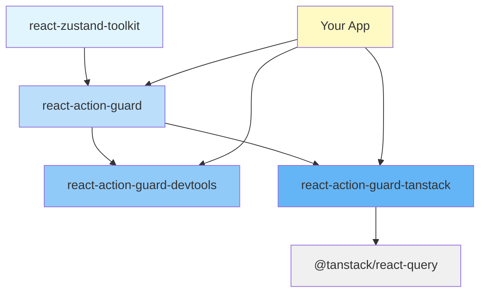

## Packages Overview

This documentation covers four interconnected packages:

### [@okyrychenko-dev/react-action-guard](/packages/react-action-guard/)
The core library providing UI blocking management with priorities, scopes, and automatic cleanup.

**Key Features:**
- Priority-based blocking system
- Scoped blocking (global, specific areas, multiple scopes)
- Automatic cleanup on unmount
- Timeout mechanism with callbacks
- Provider pattern for isolated stores
- Advanced hooks (confirmable, scheduled, conditional blockers)
- Middleware system for analytics and logging

### [@okyrychenko-dev/react-action-guard-devtools](/packages/react-action-guard-devtools/)
Developer tools for visualizing, debugging, and monitoring UI blocking events in real-time.

**Key Features:**
- Real-time timeline of blocking events
- Active blockers view
- Event filtering and search
- Pause/Resume recording
- Keyboard shortcuts
- Production-safe (auto-disabled in production)

### [@okyrychenko-dev/react-action-guard-tanstack](/packages/react-action-guard-tanstack/)
TanStack Query integration for seamless UI blocking based on queries and mutations.

**Key Features:**
- Automatic blocking based on query/mutation states
- Dynamic reasons for different states
- Priority system for multiple operations
- Full TypeScript support
- All TanStack Query hooks covered

### [@okyrychenko-dev/react-zustand-toolkit](/packages/react-zustand-toolkit/)
A powerful toolkit for creating type-safe Zustand stores with automatic shallow comparison and provider patterns.

**Key Features:**
- Automatic shallow equality checks
- Provider pattern for isolated instances
- Smart resolution between global and context stores
- Full TypeScript support with type inference
- Zero configuration

## Quick Example

```tsx
import { useBlocker, useIsBlocked } from '@okyrychenko-dev/react-action-guard';

function MyComponent() {
  const [isLoading, setIsLoading] = useState(false);
  
  // Automatically block UI while loading
  useBlocker('my-operation', {
    scope: 'form',
    reason: 'Saving data...',
    priority: 10,
    timeout: 30000, // Auto-remove after 30 seconds
  }, isLoading);
  
  const isFormBlocked = useIsBlocked('form');
  
  return (
    <button disabled={isFormBlocked} onClick={handleSave}>
      Save
    </button>
  );
}
```

## Installation

```bash
# Core library
npm install @okyrychenko-dev/react-action-guard zustand

# DevTools (development)
npm install -D @okyrychenko-dev/react-action-guard-devtools

# TanStack Query integration (optional)
npm install @okyrychenko-dev/react-action-guard-tanstack @tanstack/react-query

# Zustand Toolkit (used internally by action-guard)
npm install @okyrychenko-dev/react-zustand-toolkit zustand
```

## Why React Action Guard?

### Problem
Managing UI blocking states in React apps is complex:
- Multiple async operations can run simultaneously
- Need to coordinate blocking across different UI areas
- Risk of infinite blocking if operations fail
- Memory leaks from forgotten cleanup
- Difficulty debugging blocking states

### Solution
React Action Guard provides a centralized, declarative approach:
- **Automatic Management**: Hooks handle lifecycle automatically
- **Priority System**: Control which operations take precedence
- **Scoped Blocking**: Block specific UI areas, not everything
- **Safety Mechanisms**: Timeouts prevent infinite blocking
- **Developer Tools**: Visual debugging of blocking states
- **Type-Safe**: Full TypeScript support

## Architecture



**Package Relationships:**
- `react-zustand-toolkit` provides the store foundation
- `react-action-guard` builds the blocking system on top
- `react-action-guard-devtools` adds debugging capabilities
- `react-action-guard-tanstack` integrates with TanStack Query

[Learn more about the architecture →](/architecture/)

## Next Steps

<div class="tip custom-block">
  <p class="custom-block-title">Get Started</p>
  <p>New to React Action Guard? Start with the <a href="/getting-started">Getting Started guide</a>.</p>
</div>

<div class="info custom-block">
  <p class="custom-block-title">Explore Packages</p>
  <p>Learn about each package in detail:</p>
  <ul>
    <li><a href="/packages/react-action-guard/">react-action-guard</a> - Core blocking system</li>
    <li><a href="/packages/react-action-guard-devtools/">react-action-guard-devtools</a> - DevTools</li>
    <li><a href="/packages/react-action-guard-tanstack/">react-action-guard-tanstack</a> - TanStack integration</li>
    <li><a href="/packages/react-zustand-toolkit/">react-zustand-toolkit</a> - Zustand toolkit</li>
  </ul>
</div>

<div class="warning custom-block">
  <p class="custom-block-title">See Examples</p>
  <p>Check out <a href="/packages/react-action-guard/examples/basic-usage">real-world examples</a> including shopping carts, multi-step forms, and dashboards.</p>
</div>
