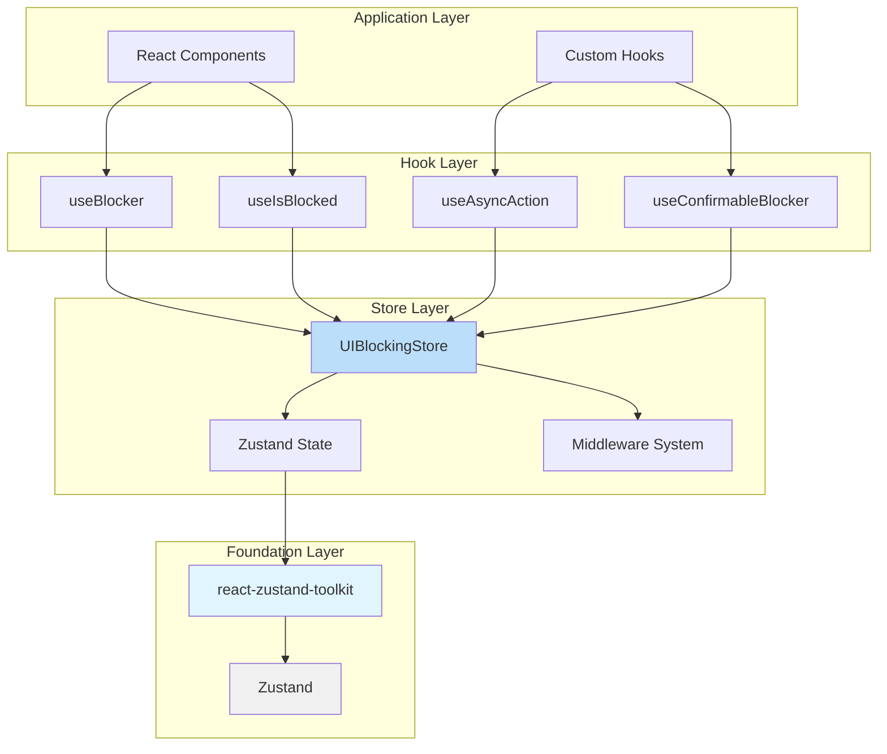
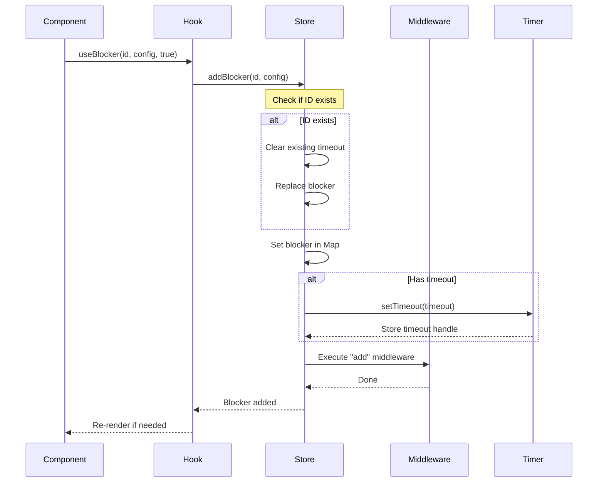
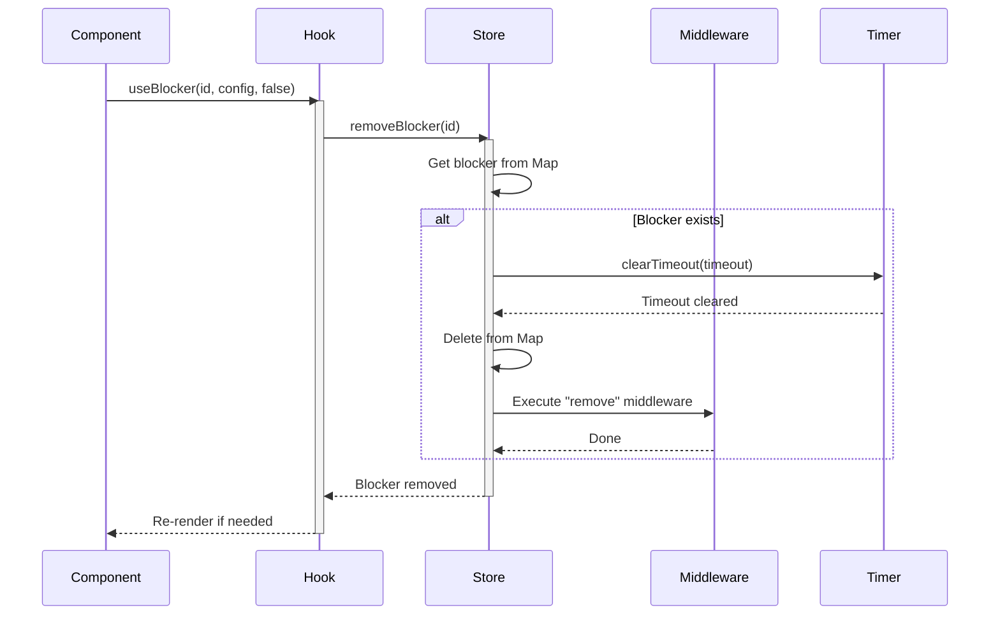
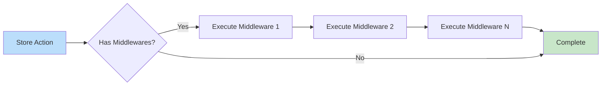

# Architecture Deep Dive

This document provides a comprehensive architectural overview of `react-action-guard`, explaining how the library works internally and the design decisions behind it.

## Table of Contents

[[toc]]

## Overview

React Action Guard is built on top of [Zustand](https://zustand-demo.pmnd.rs/) and uses [@okyrychenko-dev/react-zustand-toolkit](/packages/react-zustand-toolkit/) for enhanced store capabilities. The architecture is designed for:

- **Performance**: Minimal re-renders through selective subscriptions
- **Flexibility**: Support for global and isolated stores
- **Extensibility**: Plugin system via middleware
- **Type Safety**: Full TypeScript support with type inference
- **Developer Experience**: Easy to use, hard to misuse

## High-Level Architecture



## Store Structure

### State Shape

The store maintains a `Map` of blockers for O(1) lookup and manipulation:

```typescript
interface UIBlockingStoreState {
  blockers: Map<string, StoredBlocker>;
  middlewares: Map<string, Middleware>;
  timeouts: Map<string, NodeJS.Timeout>;
}

interface StoredBlocker {
  id: string;
  scope: string | string[];
  reason: string;
  priority: number;
  timestamp: number;
  timeout?: number;
  onTimeout?: (blockerId: string) => void;
}
```

**Why `Map` instead of object?**
- O(1) insertion, deletion, lookup
- Preserves insertion order
- Better TypeScript type narrowing
- Built-in iteration methods

### Store Actions

```typescript
interface UIBlockingStoreActions {
  // Core operations
  addBlocker(id: string, config: BlockerConfig): void;
  removeBlocker(id: string): void;
  updateBlocker(id: string, config: Partial<BlockerConfig>): void;
  
  // Queries
  isBlocked(scope?: string | string[]): boolean;
  getBlockingInfo(scope?: string): BlockerInfo[];
  
  // Bulk operations
  clearAllBlockers(): void;
  clearBlockersForScope(scope: string): void;
  
  // Middleware
  registerMiddleware(name: string, middleware: Middleware): void;
  unregisterMiddleware(name: string): void;
}
```

[See complete store API →](../api/store)

## Blocker Lifecycle

### 1. Add Blocker

When `addBlocker` is called:



**Key Points:**
- Adding the same ID **replaces** the exists blocker (no duplicates)
- Existing timeouts are cleared before setting new ones
- Middleware runs **after** state update
- Hooks only re-render if their selector changed

### 2. Update Blocker

Updates blocker metadata without changing ID:

```typescript
updateBlocker(id: string, config: Partial<BlockerConfig>): void {
  const blocker = state.blockers.get(id);
  if (!blocker) {
    return;
  }
  
  // Merge config
  const updated = { ...blocker, ...config };
  
  // Restart timeout if new timeout provided
  if (config.timeout !== undefined) {
    clearTimeout(state.timeouts.get(id));
    if (config.timeout > 0) {
      const handle = setTimeout(() => {
        this.removeBlocker(id);
        blocker.onTimeout?.(id);
      }, config.timeout);
      state.timeouts.set(id, handle);
    }
  }
  
  state.blockers.set(id, updated);
  middleware.emit('update', { blockerId: id, config, prevState: blocker });
}
```

**Important:** Only new `timeout` values restart the timer. If not provided, existing timer continues.

### 3. Remove Blocker

Cleanup when blocker is no longer needed:



### 4. Timeout

Automatic removal after duration:

```typescript
// When timeout expires
const timeoutHandler = () => {
  const blocker = state.blockers.get(id);
  if (!blocker) {
    return;
  }
  
  // Remove blocker
  state.blockers.delete(id);
  state.timeouts.delete(id);
  
  // Emit timeout event (different from remove)
  middleware.emit('timeout', { blockerId: id, config: blocker });
  
  // Call user callback
  blocker.onTimeout?.(id);
};
```

**Timeout vs Remove:**
- `remove` - Manual removal via hook or store
- `timeout` - Automatic removal due to expiration
- Both clean up the blocker, but emit different middleware events

## Scope Resolution

### Checking if Blocked

The `isBlocked` function determines if a scope is currently blocked:

```typescript
function isBlocked(scope?: string | string[]): boolean {
  // Default to 'global'
  const scopes = Array.isArray(scope) ?  scope : [scope || 'global'];
  
  // Check if ANY blocker matches ANY of the scopes
  for (const [_, blocker] of state.blockers) {
    const blockerScopes = Array.isArray(blocker.scope) 
      ? blocker.scope 
      : [blocker.scope];
    
    // If any blocker scope intersects with checked scopes
    if (blockerScopes.some(bs => scopes.includes(bs) || scopes.includes('global'))) {
      return true;
    }
  }
  
  return false;
}
```

**Scope Matching Rules:**
1. A blocker blocks a scope if its scope **matches** the checked scope
2. Multiple scopes: ANY match means blocked
3. `'global'` scope blocks everything
4. Checking `'global'` returns true if ANY blocker exists

### Getting Blocker Information

`getBlockingInfo` returns sorted blockers for a scope:

```typescript
function getBlockingInfo(scope?: string): ReadonlyArray<BlockerInfo> {
  const targetScope = scope || 'global';
  const matches: BlockerInfo[] = [];
  
  for (const [_, blocker] of state.blockers) {
    const blockerScopes = Array.isArray(blocker.scope)
      ? blocker.scope
      : [blocker.scope];
    
    // Match on scope OR if blocker is global
    if (blockerScopes.includes(targetScope) || blockerScopes.includes('global')) {
      matches.push({
        id: blocker.id,
        reason: blocker.reason,
        priority: blocker.priority,
        scope: blocker.scope,
        timestamp: blocker.timestamp,
        timeout: blocker.timeout,
      });
    }
  }
  
  // Sort by priority (highest first), then timestamp (oldest first)
  return matches.sort((a, b) => {
    if (a.priority !== b.priority) {
      return b.priority - a.priority; // Descending
    }
    return a.timestamp - b.timestamp; // Ascending
  });
}
```

**Sorting Logic:**
1. **Primary**: Priority (highest first)
2. **Secondary**: Timestamp (oldest first)

This ensures the most important blocker shows first, with tie-breaking by age.

## Middleware System

### Architecture



### Middleware Context

Every middleware receives:

```typescript
interface MiddlewareContext {
  action: 'add' | 'update' | 'remove' | 'timeout' | 'clear' | 'clear_scope';
  blockerId: string;
  config?: BlockerConfig;
  timestamp: number;
  
  // Only for 'update' and 'remove'
  prevState?: BlockerConfig;
  
  // Only for 'clear_scope'
  scope?: string;
  count?: number; // Number of blockers cleared
}
```

### Execution Flow

```typescript
function emitMiddleware(context: MiddlewareContext): void {
  for (const [name, middleware] of state.middlewares) {
    try {
      middleware(context);
    } catch (error) {
      console.error(`Middleware "${name}" error:`, error);
      // Continue executing other middleware
    }
  }
}
```

**Error Handling:**
- Middleware errors are caught and logged
- One failing middleware doesn't stop others
- Production apps should handle errors in middleware

### Built-in Middleware

#### Logger Middleware

```typescript
const loggerMiddleware = (context: MiddlewareContext) => {
  const { action, blockerId, config } = context;
  
  console.groupCollapsed(`[Blocker] ${action}: ${blockerId}`);
  console.log('Config:', config);
  console.log('Timestamp:', new Date(context.timestamp));
  if (context.prevState) {
    console.log('Previous:', context.prevState);
  }
  console.groupEnd();
};
```

#### Analytics Middleware

```typescript
const createAnalyticsMiddleware = (config: AnalyticsConfig) => {
  const track = getTrackerForProvider(config.provider);
  
  return (context: MiddlewareContext) => {
    track(`blocker_${context.action}`, {
      blocker_id: context.blockerId,
      scope: context.config?.scope,
      priority: context.config?.priority,
      reason: context.config?.reason,
    });
  };
};
```

[Learn more about middleware →](../guides/middleware-system)

## Provider Pattern

### Global Store

By default, all hooks use a global store singleton:

```typescript
// Created once when module loads
export const uiBlockingStoreApi = createShallowStore<UIBlockingStore>((set) => ({
  // ... store implementation
}));

export const useUIBlockingStore = uiBlockingStoreApi.useStore;
```

### Isolated Stores with Provider

```typescript
export const { Provider: UIBlockingProvider } = createStoreProvider<UIBlockingStore>(
  (set) => ({
    // ... same implementation
  }),
  'UIBlocking'
);
```

**Under the hood:**
1. `createStoreProvider` creates a React Context
2. Provider component creates a new store instance
3. Hooks check for context first, then fall back to global

### Smart Resolution

Hooks use this pattern:

```typescript
function useBlocker(id: string, config: BlockerConfig, isActive = true) {
  // Try to get store from context
  const contextStore = useOptionalContext();
  
  // Fall back to global store
  const store = contextStore || uiBlockingStoreApi;
  
  // Use the resolved store
  useEffect(() => {
    if (isActive) {
      store.getState().addBlocker(id, config);
      return () => store.getState().removeBlocker(id);
    }
  }, [id, isActive, /* config deps */]);
}
```

**Benefits:**
- Same hooks work with or without Provider
- No code changes needed to switch
- Testing becomes trivial (wrap in Provider)
- SSR works out of the box

[Learn more about providers →](../guides/provider-pattern)

## Performance Optimizations

### 1. Shallow Comparison

All hooks use shallow equality by default:

```typescript
const isBlocked = useUIBlockingStore(
  (state) => state.isBlocked('form'),
  // Built-in shallow comparison from toolkit
);
```

This prevents re-renders when unrelated state changes.

### 2. Selector Memoization

Complex selectors are memoized:

```typescript
const selectBlockingInfo = (scope: string) => (state: UIBlockingStore) => {
  return state.getBlockingInfo(scope);
};

// Memoized selector
const blockers = useUIBlockingStore(selectBlockingInfo('form'));
```

### 3. Map-Based Storage

Using `Map` instead of objects:
- Faster iteration
- O(1) add/remove
- Better memory usage for many blockers

### 4. Timeout Management

Timeouts are stored separately and cleaned up immediately:

```typescript
// Cleanup is automatic
state.timeouts.delete(id);
clearTimeout(handle);
```

No timeout leaks, even with frequent add/remove cycles.

## Type System

### Store Types

```typescript
// Public API types
export type BlockerConfig = {
  scope?: string | string[];
  reason?: string;
  priority?: number;
  timeout?: number;
  onTimeout?: (blockerId: string) => void;
};

// Internal storage type
type StoredBlocker = Required<BlockerConfig> & {
  id: string;
  timestamp: number;
};

// User-facing type (no internal fields)
export type BlockerInfo = Omit<StoredBlocker, 'onTimeout'>;
```

### Type-Safe Scopes

Using `createTypedHooks` for compile-time scope checking:

```typescript
type AppScopes = 'global' | 'form' | 'navigation';

const { useBlocker, useIsBlocked } = createTypedHooks<AppScopes>();

// ✅ Allowed
useBlocker('id', { scope: 'form' });

// ❌ Compile error
useBlocker('id', { scope: 'typo' });
```

Implementation:

```typescript
export function createTypedHooks<TScope extends string>() {
  return {
    useBlocker: <BlockerConfig extends { scope?: TScope | TScope[] }>(
      id: string,
      config: BlockerConfig,
      isActive?: boolean
    ) => {
      return useBlocker(id, config as any, isActive);
    },
    // ... other hooks
  };
}
```

## Design Decisions

### Why Zustand?

**Pros:**
- ✅ Simple API
- ✅ No providers needed (global store)
- ✅ Great TypeScript support
- ✅ Middleware system
- ✅ DevTools integration
- ✅ Small bundle size (~1KB)

**Alternatives considered:**
- Redux: Too heavyweight, requires provider
- Context API: Performance issues with frequent updates
- Jotai/Recoil: Atomic model not suited for this use case

### Why Priorities?

Multiple concurrent operations need coordination:

```tsx
// Background task (low priority)
useBlocker('bg-sync', { priority: 5 }, isSyncing);

// User action (medium priority)
useBlocker('form-save', { priority: 10 }, isSaving);

// Critical operation (high priority)
useBlocker('payment', { priority: 100 }, isProcessingPayment);
```

Without priorities, the last blocker would always "win", causing confusing UI states.

### Why Scopes?

Blocking everything is rarely what you want:

```tsx
// ❌ Bad: Blocks entire app
useBlocker('save', { scope: 'global' }, isSaving);

// ✅ Good: Blocks only form
useBlocker('save', { scope: 'form' }, isSaving);
```

Scopes allow fine-grained control without complex state management.

### Why Automatic Timeouts?

Operations can hang indefinitely due to:
- Network issues
- API timeouts
- Code bugs

Automatic timeouts are a safety net:

```tsx
useBlocker('api-call', {
  timeout: 30000, // Maximum 30 seconds
  onTimeout: (id) => {
    // Cleanup, show error, etc.
    showNotification('Request timed out');
  }
}, isLoading);
```

## Extension Points

### Adding New Hooks

Create composite hooks using primitives:

```typescript
export function useFormBlocking(isBlocking: boolean) {
  useBlocker('form-operation', {
    scope: ['form', 'navigation'],
    priority: 50,
    Timeout: 60000,
  }, isBlocking);
  
  const isBlocked = useIsBlocked('form');
  const blockers = useBlockingInfo('form');
  
  return { isBlocked, blockers };
}
```

### Custom Middleware

Hook into blocker lifecycle:

```typescript
const auditMiddleware: Middleware = (context) => {
  if (context.action === 'add') {
    auditLog.track('blocker_added', {
      id: context.blockerId,
      scope: context.config?.scope,
      user: getCurrentUser(),
    });
  }
};

configureMiddleware([auditMiddleware]);
```

### Store Extensions

Extend the store with new capabilities:

```typescript
const extendedStore = createShallowStore<UIBlockingStore & Custom>((set) => ({
  ...defaultBlockingStore(set),
  
  // Custom actions
  blockAll: () => set({ /* ... */ }),
  unblockAll: () => set({ /* ... */ }),
}));
```

## Future Enhancements

Potential improvements being considered:

1. **Async Middleware**: Support for async middleware execution
2. **Blocker Groups**: Manage related blockers as a group
3. **Persistence**: Save/restore blocking state across sessions
4. **React Server Components**: Support for RSC
5. **Streaming SSR**: Improved SSR support with streaming

[See roadmap →](/roadmap)

## Summary

React Action Guard's architecture emphasizes:

- **Simplicity**: Built on proven primitives (Zustand, React hooks)
- **Performance**: Optimized for minimal re-renders
- **Flexibility**: Works globally or with isolated instances
- **Extensibility**: Middleware and type systems allow customization
- **Safety**: Automatic cleanup and timeouts prevent common issues

This design enables the library to scale from simple use cases to complex applications while maintaining a clean, intuitive API.

## Next Steps

- **[Store Implementation Details](../internals/store-implementation)** - For contributors
- **[Middleware Architecture](../internals/middleware-architecture)** - Deep dive into middleware
- **[Performance Guide](../internals/performance)** - Optimization techniques
- **[Best Practices](../../guides/best-practices)** - Recommended patterns
